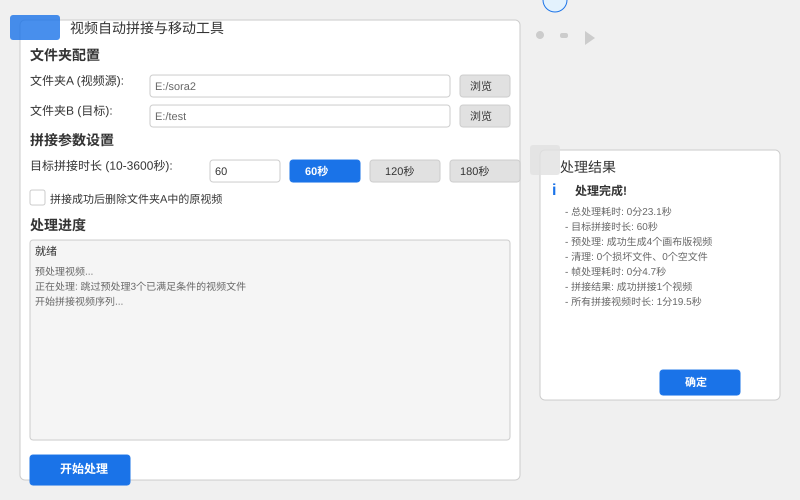

# 视频自动拼接与移动工具

## 功能介绍
这是一款图形桌面程序，支持用户手动触发操作：从自选的"文件夹 A"中读取MP4视频，按规则拼接为总时长≥用户设定秒数的视频并移动至自选的"文件夹 B"；未满足拼接条件的视频保留在"文件夹 A"，同时自动处理异常文件与程序中断场景。

## 界面预览

以下是程序运行时的界面效果：



**界面说明：**
- 左侧为主界面，包含文件配置、拼接参数设置和处理进度显示
- 右侧为处理完成后的结果弹窗，展示详细的处理统计信息
- 支持自定义目标拼接时长，默认提供60秒、120秒、180秒选项
- 处理过程中实时显示进度信息，包括预处理、优化和拼接步骤

## 安装依赖
1. 确保已安装Python 3.8或更高版本
2. 创建并激活虚拟环境：
   ```bash
   python -m venv venv
   # Windows下激活
   venv\Scripts\activate
   # macOS/Linux下激活
   # source venv/bin/activate
   ```

3. 安装依赖：
   ```bash
   pip install -r requirements.txt
   ```

## 运行程序
### 方法一：直接运行Python脚本
```bash
python video_splitter.py
```

### 方法二：使用打包好的可执行文件
直接运行`dist`目录下的`视频自动拼接与移动工具_修复版.exe`文件（推荐）

#### 自行打包程序步骤：
如果需要重新打包程序，请确保已激活虚拟环境并安装了PyInstaller，然后执行以下命令：
```bash
pyinstaller video_splitter.spec
```

或使用以下完整命令创建单文件可执行程序：
```bash
pyinstaller --name "视频自动拼接与移动工具_修复版" --windowed --noconsole --onefile video_splitter.py
```

打包完成后，可执行文件将位于`dist`目录中。

## 使用说明
1. 启动程序后，通过"浏览"按钮选择"文件夹 A"（待处理视频源）和"文件夹 B"（拼接后视频目标）
2. 设置目标视频时长（默认60秒，可选60/120/180秒或自定义）
3. 可选勾选"拼接成功后删除文件夹A中的原视频"选项
4. 点击"开始处理"按钮启动流程
5. 程序会自动：
   - 按文件名中的日期信息排序视频（日期最新的文件排在最前）
   - 单个视频时长≥设定秒数：直接移动至"文件夹 B"
   - 单个视频时长＜设定秒数：按排序顺序依次拼接后续视频，直至总时长≥设定秒数
   - 自动并行预处理视频（最多6个线程同时处理）
   - 处理异常文件（损坏文件、空文件）
6. 处理完成后会显示结果汇总弹窗

## 核心特性
- **智能排序**：基于文件名中的日期信息自动排序
- **自定义时长**：可根据需求设置目标视频的最小时长
- **并行处理**：采用多线程技术加速视频预处理过程
- **零弹窗体验**：执行过程中不会弹出任何终端窗口，提供纯粹的GUI体验
- **安全恢复**：无论处理过程是否正常结束，"开始处理"按钮状态都能正确恢复
- **自动清理**：处理完成后自动清理所有临时文件，不会占用磁盘空间
- **异常处理**：自动识别并处理损坏文件、空文件等异常情况

## 注意事项
1. 日期解析：程序仅识别文件名中"年-月-日"或"年月日"格式的日期（如20240520、2024-05-20）
2. 属性处理：拼接后视频属性以该序列中最后一个视频的属性为准
3. 文件命名：拼接后的文件采用"参与拼接的原文件名累加"格式
4. 临时文件：程序会自动清理历史临时文件
5. 异常处理：损坏文件和空文件会被自动删除
6. 权限要求：请确保程序对文件夹A和文件夹B具有读写权限

## 常见问题
- **问题**：选择文件夹后提示无访问权限
  **解决方法**：请选择具有读写权限的文件夹路径

- **问题**：拼接视频时程序无响应
  **解决方法**：超大文件（如单个视频＞1GB）可能导致拼接耗时增加，请耐心等待

- **问题**：拼接后的视频没有声音
  **解决方法**：请确保源视频包含音频轨道，程序会自动处理音频

- **问题**：程序提示缺少ffmpeg
  **解决方法**：程序依赖系统中的ffmpeg，建议安装ffmpeg并将其添加到系统环境变量

## 版本信息
- **最新版本（修复版）**：
  - 修复了"开始处理"按钮在异常情况下可能消失的问题
  - 优化了UI状态恢复机制，添加了安全的异常捕获
  - 确保所有子进程调用不会弹出终端窗口
  - 增强了程序稳定性

- V2.0：
  - 整合用户确认的文件夹选择、属性处理、中断清理等规则
  - 补充交互细节，提升用户体验